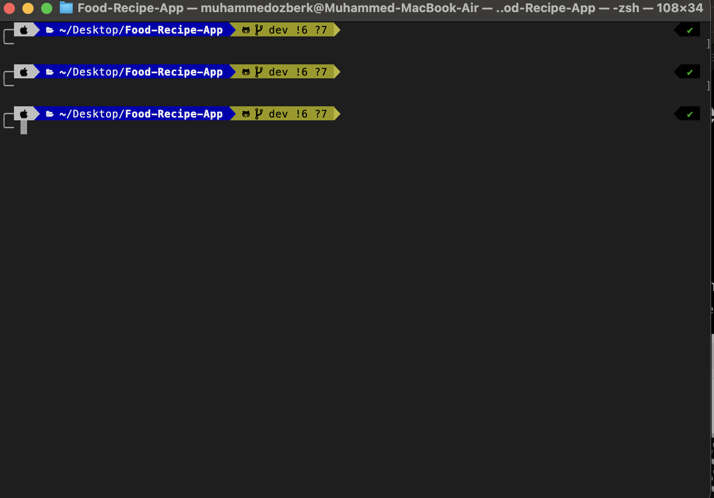

# Dotfiles

Bu proje, terminal ayarlarımı yedeklemek ve GitHub'a yüklemek için kullanılan bir depodur. İçerisinde Zsh ve Powerlevel10k konfigürasyon dosyalarım bulunmaktadır.

## İçerik

- `.zshrc`: Zsh terminali için konfigürasyon dosyası.
- `.p10k.zsh`: Powerlevel10k tema konfigürasyon dosyası.

## Kurulum

Aşağıdaki adımlar, dotfiles'ları farklı işletim sistemlerinde kurmak için kullanılabilir. Eğer sisteminizde gerekli araçlar yüklü değilse, talimatları takip ederek kurulum yapabilirsiniz.

### **Linux ve macOS**

1. **Zsh Kurulumu**

   Zsh genellikle Linux ve macOS sistemlerinde varsayılan olarak bulunur. Eğer yüklü değilse, aşağıdaki komutlarla yükleyebilirsiniz:

   - **Ubuntu/Debian:**

     ```bash
     sudo apt update
     sudo apt install zsh
     ```

   - **Fedora:**

     ```bash
     sudo dnf install zsh
     ```

   - **macOS (Homebrew ile):**

     ```bash
     brew install zsh
     ```

2. **Powerlevel10k Teması Kurulumu**

   Powerlevel10k temasını yüklemek için önce [oh-my-zsh](https://ohmyz.sh/) kurmanız gerekebilir. Daha sonra Powerlevel10k'yi yükleyebilirsiniz:

   ```bash
   # Oh My Zsh'i kurun (eğer daha önce kurulu değilse)
   sh -c "$(curl -fsSL https://raw.github.com/ohmyzsh/ohmyzsh/master/tools/install.sh)"

   # Powerlevel10k'yi yükleyin
   git clone --depth=1 https://github.com/romkatv/powerlevel10k.git $ZSH_CUSTOM/themes/powerlevel10k
   ```

3. **Depoyu Klonlayın**

   Terminalde aşağıdaki komutu kullanarak bu depo dizinine klonlayabilirsiniz:

   ```bash
   git clone <your-git-repo-url> ~/dotfiles
   ```

4. **Dosyaları Yükleyin**

   Kopyalanan dosyaları ilgili konumlarına taşıyın:

   ```bash
   cp ~/dotfiles/.zshrc ~/.zshrc
   cp ~/dotfiles/.p10k.zsh ~/.p10k.zsh
   ```

5. **Zsh'yi Yeniden Başlatın**

   Yapılandırma değişikliklerinin etkili olabilmesi için Zsh oturumunu yeniden başlatın:

   ```bash
   exec zsh
   ```

### **Windows**

Windows'ta Zsh ve Powerlevel10k kullanmak için [Windows Subsystem for Linux (WSL)](https://docs.microsoft.com/en-us/windows/wsl/) veya [Cygwin](https://www.cygwin.com/) gibi bir terminal emülatörü kurmanız gerekecektir.

1. **WSL veya Cygwin Kurulumu**

   WSL veya Cygwin'i yükledikten sonra yukarıdaki Linux ve macOS kurulum adımlarını takip edebilirsiniz.

2. **Depoyu Klonlayın ve Dosyaları Yükleyin**

   Yukarıdaki adımları takip ederek gerekli dosyaları yükleyin ve konfigürasyonları uygulayın.

## Terminal Görüntüsü

Aşağıda terminal ayarlarımın görseli bulunmaktadır:




## Notlar

- `~/.zshrc` dosyası, Zsh terminalinizin genel ayarlarını ve eklentilerini içerir.
- `~/.p10k.zsh` dosyası, Powerlevel10k temasının özelleştirilmiş ayarlarını içerir.
- Her iki dosya da terminal deneyiminizi kişiselleştirmek için kullanılır.

## Lisans

Bu projede kullanılan dosyalar kişisel kullanım içindir. Başka bir şekilde dağıtım yapmadan önce lisans şartlarını gözden geçirdiğinizden emin olun.
```

Bu README dosyasında, Zsh ve Powerlevel10k'nin nasıl kurulacağı ve kullanılacağı hakkında bilgi verdim. Ayrıca, eksik araçların nasıl yüklenebileceğini de belirttim. Görüntü yollarını ve diğer ayrıntıları projenize göre güncellediğinizden emin olun.